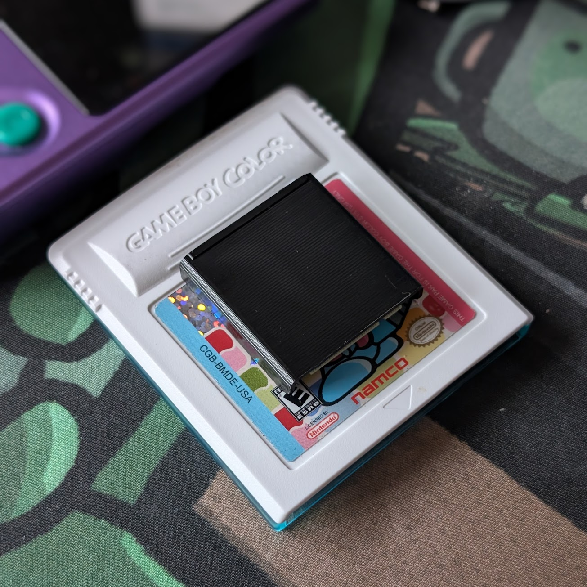

# CGB uCart

CGB uCart is a spec for a small format Game Boy and Game Boy Color cartridge standard. Originally designed for the Time Frog Color and Egg Boy Color due to their small size requirements, I'm opening up the spec for others to utilize in their own projects.

## Reference Files
- KiCad
    - `cgb_ucart.kicad_sym`
        - Reference symbol for the card edge connector. 32-pins laid out to match OEM GB/GBC cartridge for easy implementation into existing designs. Pin numbers correspond to the associated pins on the M.2 edge connector. Used in conjuction with reference footprint.
    - `cgb_ucart.pretty`
        - Reference footprint for the card edge connector. Includes board outline designed to fit the reference cart shell. Pay close attention to keep out zones and maximum noted clearance heights. Used in conjuction with reference symbol.
- CAD
    - `cgbucart_snapfit_mm_dd_yy.step`
        - Reference cartridge shell that conforms to physical spec and is verified to work with Time Frog Color and Egg Boy Color. Includes two components that are intended to snap fit together without fasteners. Recommended materials are POM(Delrin) and PC. SLS and MJF nylon should also work, but are untested.

## Physical Spec
- Connector
    - Type: M.2
    - Key: B
    - B2B clearance: min. 2.45mm
    - Recommended part: TE Connectivity 1-2199230-0
- Device-side cartridge slot
    - Minimum width: 29.4mm
    - Minimum height: 6.5mm
- Cartridge shell
    - Maximum width: 29mm
    - Maximum body height: 6.1mm
    - Minimum length: 29.5mm
- Cartridge PCB
    - Thickness: 0.8mm
    - Surface finish: ENIG or hard gold
    - See reference KiCad footprint for reference board outline

## Pinout(M.2 relative)
Note: On M.2 cards, even pins are on one side of the board/connector, with odds on the opposite side. This is to note that both address and data pins -- as separate groups -- are contiguous and in-order on the same side of the connector, despite how it looks in the table below.

| Pin # | Description |
| --- | --- |
|21|VCC|
|23|VCC|
|24|A0|
|25|VCC|
|26|A1|
|28|A2|
|30|A3|
|32|A4|
|34|A5|
|36|A6|
|38|A7|
|39|Reset|
|40|A8|
|41|PHI|
|42|A9|
|43|\WR|
|44|A10|
|45|\RD|
|46|A11|
|47|CS|
|48|A12|
|49|VIN/Audio|
|50|A13|
|52|A14|
|54|A15|
|61|D0|
|63|D1|
|65|D2|
|67|D3|
|69|D4|
|70|GND|
|71|D5|
|72|GND|
|73|D6|
|74|GND|
|75|D7|